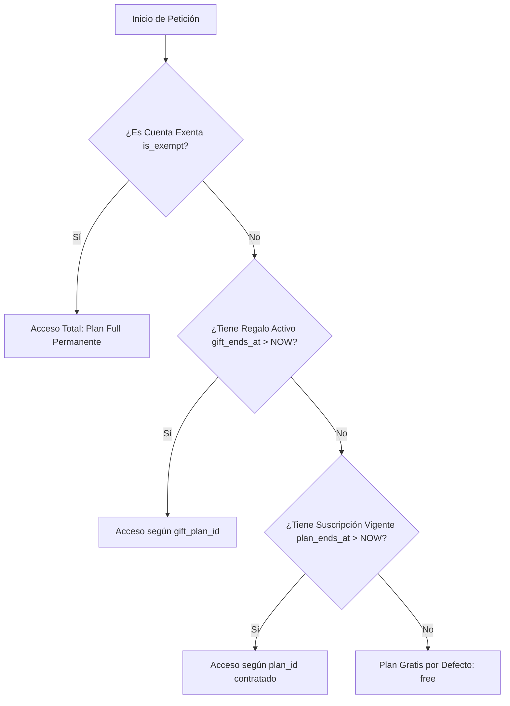

# Guía de Administración: Planes, Descuentos, Regalos y Actualización de Precios

Esta guía detalla los métodos y procedimientos para administrar planes comerciales, otorgar bonificaciones (descuentos porcentuales o membresías de regalo) y actualizar tarifas masivamente en **Gestión SySO** tanto desde la **Consola de SuperAdmin (`/admin`)** como desde la base de datos.

---

## 1. Métricas y Valores de los Planes Comerciales

| ID del Plan (`plan_id`) | Nombre Comercial | Límite Clientes | Límite Miembros | Herramientas y Módulos Incluidos |
| :--- | :--- | :--- | :--- | :--- |
| **`free`** | **Plan Gratis** | Hasta 1 cliente | Hasta 1 miembro | Dashboard, Clientes, Equipo, Prog. Gestión Anual, Prog. Capacitación, Capacitaciones online, Acciones Correctivas, Accidentes + Informe IA, Matriz de Riesgos, Nómina de Personal, Perfil. |
| **`basic_5`** | **Plan Básico** | Hasta 5 clientes | Hasta 5 miembros | Todo lo de `free` + **Control de Extintores (+ PDF)** y **Control Eléctrico (+ PDF)**. |
| **`standard_25`** | **Plan Estándar** | Hasta 25 clientes | Hasta 25 miembros | Todo lo de `basic_5` + **Constancias de Visita** y **Avisos de Riesgo**. |
| **`libre`** | **Plan Full** | **Ilimitado** | **Ilimitado** | **Acceso Total**: Todo lo de `standard_25` + **Checklist Personalizados**, **Legajo Técnico Online** y **Portal de Clientes**. |

---

## 2. Administración desde la Consola SuperAdmin (`/admin`)

Ya **no es necesario escribir código SQL en Supabase** para administrar los beneficios de tus clientes. Desde la consola `/admin` puedes gestionar todo de forma visual e instantánea.

### A. Otorgar Planes de Regalo (Gift Plans)
Si deseas premiar a una consultora con días de acceso gratuito a un plan superior (ej: 30 días de Plan Full):
1. Ingresa a `/admin` y ve a la pestaña **Organizaciones (Tenants)**.
2. Busca la organización y haz clic en **Gestionar**.
3. En la sección **Bonificación / Regalo de Días**:
   * Selecciona el **Plan de Regalo** (`Plan Básico`, `Plan Estándar` o `Plan Full`).
   * Selecciona la **Duración** (`7`, `15`, `30`, `60` o `90` días).
4. Haz clic en **Guardar Cambios**.

> [!TIP]
> **¿Qué ve el cliente?**
> * En su Perfil verá: **Plan Full (Bonificado)** con costo mensual **Bonificado** y el texto: *"Tu organización tiene un beneficio especial y acceso completo al plan Plan Full bonificado hasta el DD/MM/AAAA."*
> * En el modal **Modificar tu Plan**, el plan aparecerá como **Activo**.
> * Al cumplirse los días, el sistema degrada la cuenta automáticamente a su plan base sin generar deudas ni bloqueos.

---

### B. Aplicar Descuentos Comerciales en Mercado Pago
Si ofreces una promoción comercial (ej: 20% OFF por 60 días):
1. En el modal de **Gestionar Organización**, ve a la sección **Descuento Comercial en Mercado Pago**.
2. Selecciona el **Porcentaje de Descuento** (`10%`, `15%`, `20%`, `25%`, `30%` o `50%`).
3. Selecciona la **Vigencia del Descuento** (`15`, `30`, `60`, `90`, `180` o `365` días).
4. Haz clic en **Guardar Cambios**.

> [!NOTE]
> **¿Cómo impacta en la app?**
> * La ventana de selección de planes del cliente mostrará automáticamente el **precio bonificado** (ej: `$28.000 / mes` en vez de `$35.000`) con el badge `🏷️ 20% OFF BONIFICADO`.
> * El link de pago de Mercado Pago se generará por el importe reducido de forma automática.
>
> **¿Cómo actualizar la cuota de Mercado Pago si se le vence o le quitas el descuento?**
> * Si el cliente ya está suscripto a Mercado Pago, en el mismo modal de **Gestionar** verás la tarjeta **💳 Suscripción en Mercado Pago**.
> * Para quitarle el descuento y pasar su débito al precio regular: Selecciona `Sin descuento (0%)`, mantén marcada la casilla ☑️ *Actualizar cuota de débito en Mercado Pago al guardar*, y presiona **Guardar Cambios**.
> * El backend llamará a la API de Mercado Pago y actualizará inmediatamente su débito automático al valor regular (ej: `$35.000 / mes`).

---

### C. Marcar Cuentas Exentas (Demos / Cuentas Propias)
Para tus cuentas de demostración internas (como `sebastian-merlassino` o `admin-syso`) que no deben pagar nunca:
1. En el modal de gestión, activa la casilla **Cuenta Exenta (Plan Libre Ilimitado)**.
2. Haz clic en **Guardar Cambios**.
3. **Beneficio Financiero:** La cuenta disfrutará de acceso total ilimitado pero **no sumará falsamente al MRR estimado del dashboard**, manteniendo tus métricas contables 100% limpias.

---

## 3. Gestión y Actualización Masiva de Precios (SaaS + Mercado Pago)

Cuando necesites actualizar las tarifas del SaaS por inflación o costos operativos, utiliza la pestaña **🏷️ Gestión de Precios** en `/admin`.

### Opciones de Alcance:
1. **Aplicar a Nuevas Contrataciones:**
   * Actualiza el valor base para futuras compras en el Checkout.
   * Modifica instantáneamente los precios mostrados en el modal "Modificar tu Plan" de todos los usuarios.
2. **Actualizar Débitos en Mercado Pago:**
   * Se conecta a la API oficial de Mercado Pago (`PreApproval.update`).
   * Modifica el débito recurrente de las suscripciones automáticas activas de los clientes ya suscriptos.
   * Muestra un **reporte detallado en tiempo real** con el estado de cada organización procesada.

---

## 4. Orden de Prioridad del Plan Efectivo

El sistema y el middleware resuelven el acceso de cada organización siguiendo esta jerarquía estricta:



---

## 5. Procedimientos de Emergencia / Respaldo vía SQL (Supabase)

Si por alguna razón técnica no tienes acceso al SuperAdmin y necesitas ejecutar cambios directos en la base de datos, utiliza el **SQL Editor** de Supabase:

### Otorgar Plan de Regalo por SQL
```sql
UPDATE public.tenants
SET 
  gift_plan_id = 'libre',
  gift_ends_at = NOW() + INTERVAL '30 days'
WHERE slug = 'slug-de-la-organizacion';
```

### Aplicar Descuento Comercial por SQL
```sql
UPDATE public.tenants
SET 
  discount_percentage = 20,
  discount_ends_at = NOW() + INTERVAL '60 days'
WHERE slug = 'slug-de-la-organizacion';
```

### Marcar Cuenta Exenta por SQL
```sql
UPDATE public.tenants
SET is_exempt = true
WHERE slug = 'slug-de-la-organizacion';
```
