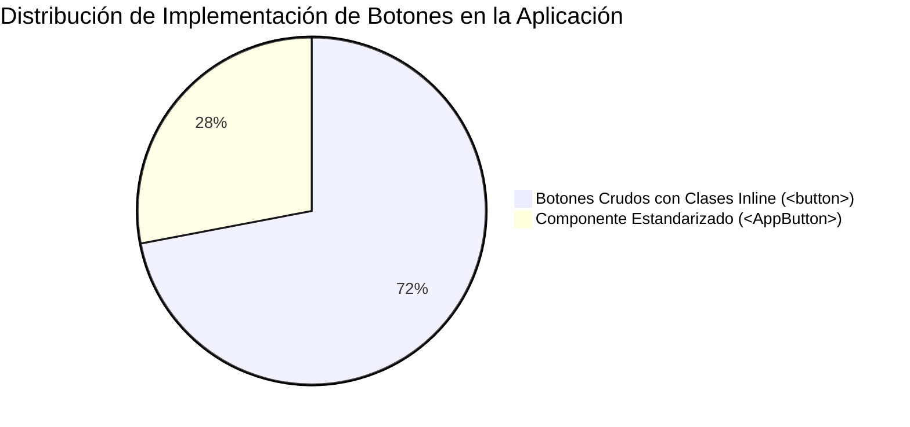
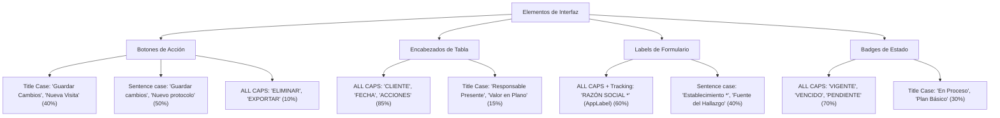
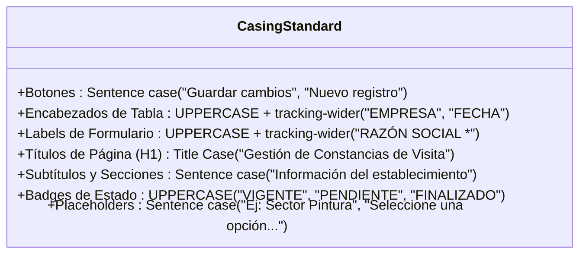
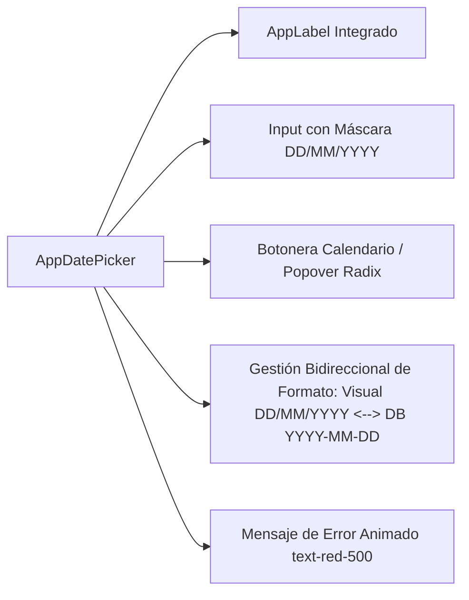
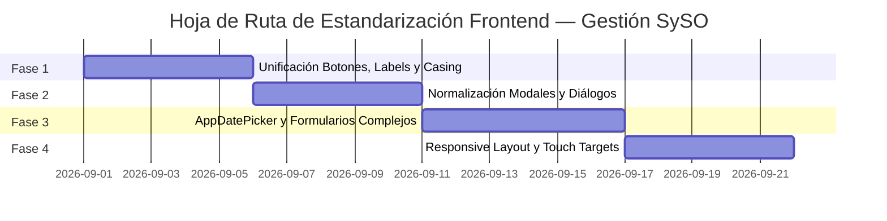

# Auditoría de Consistencia UI y Plan de Mejoras — Gestión SySO

**Documento Técnico y Diagnóstico Estratégico de Frontend**  
**Versión:** 1.0  
**Fecha de Elaboración:** 25 de Agosto de 2026  
**Rol:** Arquitecto Frontend Senior & Especialista UI/UX / Design Systems  
**Ámbito:** Arquitectura Visual, Componentes Reutilizables, Tipografía, Responsive Mobile-First y Normalización de Código (Next.js, React, Tailwind CSS)

---

## 1. Resumen Ejecutivo

### 1.1 Diagnóstico General
La aplicación SaaS **Gestión SySO** cuenta con una base de diseño visual sólida basada en la identidad corporativa (`#468DFF`, `#0511F2`, `slate-50/100/900`, `Inter` y `Outfit`), complementada con componentes primitivos en `src/components/ui/` (`AppButton`, `AppInput`, `AppSelect`, `AppLabel`, `AppConfirmDialog`, `AppUnsavedChangesDialog`, `AppInfoModal`, `AppEmptyState`, `AppFormNavigator`).

Sin embargo, tras el análisis estático exhaustivo de las más de 25 vistas del sistema (`src/app/[tenant-slug]/*`, `src/app/admin/*`, `src/app/login/*`, `src/app/onboarding/*`, `src/app/capacitar/*`), se detecta una **deuda técnica de consistencia visual** derivada del crecimiento acelerado de funcionalidades:



1. **Adopción Incompleta de Componentes UI Primitivos:**
   - Existen más de **600 instancias de etiquetas `<button>` nativas con clases de Tailwind CSS inline** conviviendo en paralelo con `<AppButton>`.
   - Módulos críticos como `admin/page.js` y `login/page.js` no consumen los componentes estándar del Design System, manteniendo estilos desconectados.
2. **Ausencia de Componente Oficial de Selección de Fechas (`AppDatePicker`):**
   - No existe un selector de fechas unificado en `src/components/ui/`. Cada módulo repite de manera aislada un patrón híbrido (`input type="text"` + formateo `formatAsDateInput` + icono `Calendar` + `input type="date"` transparente superpuesto), o directamente utiliza `<input type="date">` nativo con distintos paddings y tipografías.
3. **Duplicación de Lógica y Estructura de Modales:**
   - Los modales secundarios (Envío de PDF por Email / WhatsApp, Visualización de Galerías de Fotos, Compartir Capacitación) están reimplementados como JSX inline con etiquetas `<div>` fijas en más de 8 módulos distintos, en lugar de extender `@radix-ui/react-dialog` o un componente reusable `AppModal` / `AppSendDialog`.
4. **Dispersión en Casing y Naming de Textos:**
   - Coexisten tres criterios incompatibles de capitalización en la botonera y encabezados: *Title Case* ("Guardar Cambios", "Nueva Visita"), *Sentence case* ("Guardar cambios", "Nuevo protocolo") y *ALL CAPS* ("ELIMINAR", "EXPORTAR").
5. **Brechas de Experiencia Táctil (Mobile-First):**
   - Botones de acción en tablas de tamaño compacto (`h-8 w-8` o `p-1.5` ~32px) se encuentran por debajo del umbral ergonómico táctil recomendado (mínimo 44×44px).
   - Los modales en pantallas móviles se renderizan como ventanas emergentes centradas en lugar de adaptarse al formato moderno de *Bottom Sheets* deslizables.

### 1.2 Nivel de Madurez del Sistema de Diseño (Design System Maturity)

| Dimensión | Nivel Actual | Diagnóstico | Objetivo Post-Estandarización |
| :--- | :---: | :--- | :---: |
| **Tokens de Color y Estilos Base** | **Alto (8.5/10)** | Definidos en `tailwind.config.js` y `globals.css`. | **9.5/10** |
| **Consistencia de Botones** | **Medio-Bajo (4.5/10)** | Primitiva creada pero con baja adopción global (>600 raw buttons). | **9.5/10** |
| **Formularios e Inputs** | **Medio (5.5/10)** | Buena suite primitiva (`AppInput`, `AppSelect`), pero con inputs crudos mezclados. | **9.0/10** |
| **Selectores de Fecha (Date Pickers)** | **Crítico (2.5/10)** | Inexistencia de componente central; 4 implementaciones diferentes. | **9.5/10** |
| **Modales y Diálogos Emergentes** | **Medio-Bajo (5.0/10)** | Buenos diálogos Radix (`AppConfirmDialog`, `AppInfoModal`), pero alta duplicación inline. | **9.0/10** |
| **Tipografía y Casing** | **Medio (5.0/10)** | Buenas fuentes (`Outfit`/`Inter`), pero disparidad en mayúsculas/minúsculas. | **9.5/10** |
| **Adaptabilidad Mobile & Touch** | **Medio-Bajo (4.5/10)** | Layout de tabla compacto funcional, pero touch targets reducidos y modales no adaptados. | **9.0/10** |

---

## 2. Inventario de Inconsistencias Visuales

### 2.1 Botones y Labels

A continuación se detallan las principales discrepancias encontradas en la botonera y etiquetas del sistema:

| Elemento / Acción | Archivo / Módulo Afectado | Implementación Actual (Código / Clases) | Estándar Requerido (`AppButton` / `AppLabel`) | Impacto Visual / UX |
| :--- | :--- | :--- | :--- | :--- |
| **Botón Primario de Filtro ("Nuevo...")** | `[tenant-slug]/visitas/page.js` | `<button className="px-3 py-1.5 bg-[#468DFF] text-white rounded-xl text-xs font-bold shadow-lg shadow-[#468DFF]/10 shrink-0">` Texto: `+ Nueva Constancia` | `<AppButton variant="primary" size="sm">Registrar visita</AppButton>` | Discrepancia de padding vertical, falta de animación scale y texto en Title Case con signo `+`. |
| **Botón Primario de Filtro ("Nuevo...")** | `[tenant-slug]/protocolos/ruido/page.js` | `<button className="px-3 py-1.5 bg-[#468DFF] text-white rounded-xl text-xs font-bold ...">` Texto: `Nuevo protocolo` | `<AppButton variant="primary" size="sm">Nuevo protocolo</AppButton>` | Texto en Sentence case, pero con padding y clases inline en lugar de componente. |
| **Botón Primario Admin** | `admin/page.js` | `<button className="px-4 py-2 bg-[#468DFF] hover:bg-[#0511F2] text-white rounded-xl text-xs font-bold ...">` | `<AppButton variant="primary" size="sm">` | Padding mayor (`px-4 py-2`) respecto a los módulos de tenant (`px-3 py-1.5`). |
| **Botón de Login / Auth** | `login/page.js`, `register/page.js` | `<button className="w-full py-2.5 rounded-xl bg-[#468DFF] hover:bg-[#0511F2] text-white text-xs font-semibold ...">` | `<AppButton variant="primary" size="lg" className="w-full">` | Peso de fuente `font-semibold` en lugar de `font-bold`, y padding no estandarizado. |
| **Botón Secundario de Exportación (PDF/Print)** | `[tenant-slug]/visitas/page.js` | `<button className="py-1.5 px-3 text-xs font-bold border border-[#468DFF] text-[#468DFF] bg-white rounded-xl ...">` | `<AppButton variant="secondary" size="sm">` | Clases manuales redundantes que replican la variante secundaria. |
| **Botón Secundario Admin** | `admin/page.js` | `<button className="p-2 bg-slate-100 hover:bg-slate-200 text-slate-600 rounded-xl ...">` | `<AppButton variant="outline" size="sm">` | Estilo gris desalineado con la paleta corporativa `#468DFF`. |
| **Acciones de Tabla (Icon Buttons)** | `[tenant-slug]/visitas/page.js`, `capacitaciones-online/page.js` | `<AppButton variant="document-table" size="icon">` con `<FileText className="h-4.5 w-4.5" />` | `<AppButton variant="document-table" size="icon">` con icono `h-4 w-4` | Variación en tamaños de íconos internos (`h-4.5` vs `h-4` vs `h-3.5`). |
| **Acciones de Tabla Admin** | `admin/page.js` | `<button className="p-1.5 rounded-lg bg-blue-50 text-blue-600 hover:bg-blue-100">` | `<AppButton variant="document-table" size="icon">` | Uso de color genérico de Tailwind (`text-blue-600`) en lugar del token institucional `#468DFF`. |
| **Labels de Formulario** | `[tenant-slug]/correctivas/page.js` | `<label className="text-xs font-bold text-slate-600 block mb-1">` | `<AppLabel required={true}>` | Sin uppercase, sin tracking y margen inferior inconsistente (`mb-1` vs `mb-2`). |
| **Labels de Formulario** | `[tenant-slug]/visitas/page.js` (filtros) | `<label className="text-[10px] font-bold text-slate-400 uppercase tracking-wider block mb-1">` | `<AppLabel size="xs">` | Tamaño de fuente ultra reducido (`text-[10px]`) y color `text-slate-400`. |
| **Asterisco de Campo Obligatorio** | `[tenant-slug]/visitas/page.js` vs `correctivas/page.js` | `<span className="text-[#468DFF]">*</span>` vs `<span className="text-red-500">*</span>` | `<AppLabel required={true}>` (`text-[#468DFF]`) | Inconsistencia cromática en la indicación de requerimiento obligatorio (azul vs rojo). |

---

### 2.2 Date Pickers y Formularios

| Módulo / Archivo | Tipo de Selector de Fecha | Implementación Técnica | Formato Visual / UX | Inconsistencia Detectada |
| :--- | :--- | :--- | :--- | :--- |
| **Visitas** (`visitas/page.js`) | Híbrido Texto + Popover Oculto | Input `font-mono` con `formatAsDateInput` + `<input type="date" className="opacity-0 absolute">` | `DD/MM/YYYY` (con icono de calendario superpuesto) | Código JSX duplicado de 25 líneas con manipulación manual de cadenas (`split('-')`). |
| **Protocolos (Ruido, Iluminación, Puesta a Tierra, Ergonomía)** | Híbrido Texto + Popover Oculto | Mismo bloque duplicado en cada `ProtocoloForm.js` | `DD/MM/YYYY` | Código repetido 6 veces en diferentes subcarpetas sin encapsulación. |
| **Filtros de Panel Superior (Visitas, Correctivas, Control Eléctrico)** | Nativo HTML5 Visible | `<input type="date" className="border border-slate-200 rounded-lg px-2.5 py-1.5 bg-white text-slate-600 text-xs font-sans">` | Formato del navegador del sistema operativo | El usuario experimenta una UI distinta en el buscador (nativo del SO) frente al formulario interno (máscara con `DD/MM/YYYY`). |
| **Matriz de Riesgos** (`matriz-riesgos/page.js`) | Edición Masiva en Tabla | Input inline directo `type="date"` con `text-xs` | `YYYY-MM-DD` | Modificación visual abrupta en celdas de tabla sin icono de apoyo ni feedback. |
| **Admin Dashboard** (`admin/page.js`) | Desplegables de Mes y Año | Dos `<select>` independientes (`selectedYear`, `selectedMonth`) | Mes / Año | Tercer paradigma de selección temporal no compatible con el resto del SaaS. |
| **Inputs de Texto Generales** | `correctivas/page.js`, `accidentes/page.js` | `<input className="w-full border border-slate-200 rounded-xl px-3.5 py-2 text-sm bg-slate-50/50">` | `AppInput` | Mezcla de inputs crudos con instancias de `AppInput`, generando discrepancias en foco y errores. |
| **Mensajes de Error de Validación** | `AppInput.js` vs Formularios Nativos | `p.text-[10px].text-red-500.font-bold` con animación vs alertas Toast flotantes | Visual inline vs Toast | Algunos campos marcan error bajo el input, mientras otros solo disparan un Toast genérico `"Complete los campos requeridos"`. |

---

### 2.3 Ventanas Emergentes, Modales y Alertas

| Categoría de Interrupción | Componente / Archivo | Implementación y Estilos Actuales | Inconsistencias Críticas Identificadas |
| :--- | :--- | :--- | :--- |
| **Modal de Confirmación Destructiva** | `AppConfirmDialog.js` vs `AppDestructiveConfirmDialog.js` | Radix Dialog con icono `AlertTriangle` rojo y botón rojo. `AppDestructiveConfirmDialog` añade un input que exige escribir "ELIMINAR". | `AppDestructiveConfirmDialog` solo se usa en `profile/page.js`. En todos los demás módulos se usa `AppConfirmDialog` simple, sin un criterio unificado sobre cuándo requerir confirmación textual. |
| **Modal "Salir sin guardar"** | `AppUnsavedChangesDialog.js` vs Implementaciones en Páginas | Radix Dialog centrado con icono ámbar `AlertTriangle`. | **Discrepancia en textos:**<br>• Default: `"Salir sin guardar"` / `"Quedarse y editar"`<br>• En Ruido/Iluminación: `"Abandonar sin guardar"`<br>• En `AppFormNavigator`: `"Navegar sin guardar"` / `"Quedarse en este registro"` |
| **Modal de Envío (Email / WhatsApp)** | Inline en `visitas`, `protocolos/*`, `control-electrico`, `avisos` | Modal inline construido con `<div>` fijos, `bg-black/40` o `bg-slate-900/60`, sin Radix Portal. | **Grave duplicación de código:** El modal de envío (con tabs Email/WhatsApp) está copiado 8 veces. Los botones de cierre (`X`) varían entre `p-1`, `p-1.5`, con o sin borde `border-slate-200`. |
| **Modal de Visualización de Fotos** | Inline en `visitas`, `accidentes`, `extintores` | Contenedor `max-w-4xl` con fondo oscuro `bg-black/60` y botón cerrar `bg-slate-100`. | Reimplementación manual en cada módulo; no utiliza `AppInfoModal` ni Radix Dialog, con variaciones de padding y redondeo de esquinas. |
| **Alerta de Modal en Sidebar** | `Sidebar.js` (`modalAlert.show`) | Contenedor modal nativo inline con `ShieldAlert` ámbar y botones `Cancelar` / `Actualizar Plan`. | No utiliza `AppConfirmDialog` ni `AppInfoModal`, generando una estructura flotante desacoplada del sistema. |
| **Instructivos y Ayuda In-App** | `ContextualHelpPanel.js` vs `AppInfoModal.js` | • `ContextualHelpPanel`: Drawer / Slide-over lateral (`w-full sm:w-[420px]`, fondo `bg-slate-900` en header).<br>• `AppInfoModal`: Modal centrado (`max-w-4xl`, fondo `bg-slate-900` en header). | Aunque ambos respetan la cabecera oscura institucional, no hay una guía explícita sobre cuándo una ayuda contextual debe abrirse en el panel lateral o cuándo en modal centrado. |
| **Notificaciones y Toasts** | `ToastProvider.js` | Toasts en `bottom-4` (mobile) / `bottom-6 right-6` (desktop). Duración: 4s (éxito/info) y 6s (error/warning). | Totalmente funcional, pero en algunas páginas se invocan funciones locales wrappers (`triggerToast`) mientras en otras se llama a `globalToast.toast()`. |

---

## 3. Auditoría Tipográfica y Casing

### 3.1 Jerarquía de Títulos y Tipografía Base
La aplicación cuenta con dos familias tipográficas configuradas en `globals.css`:
- **Familia Primaria (Cuerpo, Datos, Botones):** `Inter, system-ui, sans-serif`
- **Familia Secundaria (Títulos y Cabeceras):** `Outfit, Inter, sans-serif` (`font-outfit`)

#### Desviaciones de Jerarquía Detectadas:

```
[Nivel H1 - Página Principal]
├── AppPageHeader (Estándar): font-outfit text-base md:text-lg font-bold text-slate-900
├── Admin Dashboard: text-2xl sm:text-3xl font-extrabold text-slate-900
├── Portal Público Capacitación: text-xl md:text-2xl font-bold text-slate-900
└── Onboarding: font-outfit text-xl sm:text-2xl font-extrabold

[Nivel H2 / H3 - Cabeceras de Sección y Formularios]
├── Formulario Visitas (H3): font-outfit text-sm font-bold text-slate-800 uppercase tracking-wider
├── Formulario Ruido / Iluminación (H3): font-outfit text-base font-bold text-slate-900 (Sentence case)
└── Admin Tabs (H2): text-lg font-bold text-slate-900
```

### 3.2 Inconsistencias de Capitalización (Casing)

Se identifican severas discrepancias de estilo entre secciones:



#### Ejemplos Específicos de Conflictos de Casing:
1. **Botones de Guardado:**
   - `visitas/page.js`: `"Guardar"` (Sentence case).
   - `empresas/page.js`: `"Guardar Empresa"` (Title Case).
   - `protocolos/ruido/components/ProtocoloForm.js`: `"Guardar Protocolo"` (Title Case) vs `"Guardar marcadores"` (Sentence case).
   - `login/page.js`: `"Enviar enlace de recuperación"` (Sentence case) vs `"Cerrar Ventana"` (Title Case).
2. **Badges de Planes y Estados:**
   - `AppPageHeader.js`: `getPlanLabel` devuelve `"Plan Full"`, `"Plan Básico"`, pero el badge aplica `uppercase` con `tracking-wider` (`PLAN FULL`, `PLAN BÁSICO`).
   - `accidentes/page.js`: Los estados de gravedad figuran en Sentence case (`"Leve"`, `"Grave"`, `"Mortal"`) mientras que en `correctivas/page.js` figuran en mayúsculas sostenidas (`"ABIERTA"`, `"EN PROCESO"`, `"CERRADA"`).

---

## 4. Evaluación Responsive (Mobile-First)

### 4.1 Touch Targets (Áreas Táctiles Mínimas)
Las directrices internacionales de accesibilidad y usabilidad móvil (WCAG 2.1 / Apple HIG / Material Design 3) establecen un **área mínima de contacto de 44×44px** (o mínimo 40×40px con 8px de separación) para cualquier elemento interactivo.

#### Hallazgos Críticos en Móvil:
1. **Icon Buttons en Tablas:**
   - Clases actuales: `size="icon"` (`h-8 w-8 p-1.5`). Representa **32×32px**.
   - **Problema:** En pantallas táctiles de 360px a 414px (smartphones estándar), el usuario suele pulsar accidentalmente el botón contiguo (ej. pulsar "Eliminar" en lugar de "Ver PDF").
2. **Buscador y Botón Flecha en Filtro Móvil:**
   - El botón de colapso de exportación móvil (`showExportMobile`) mide `h-[29px] w-[29px]`. Es excesivamente pequeño para el pulgar.
3. **Pestañas de Navegación de Formularios:**
   - Tabs compactos en `AppFormNavigator` y modales de envío tienen áreas de contacto verticales de apenas ~28px.

### 4.2 Desbordamientos Horizontales (Overflows) y Tablas
1. **Comportamiento de Tablas:**
   - Todas las tablas del SaaS utilizan `min-w-[850px]` o `min-w-[1000px]` dentro de un contenedor `overflow-auto`.
   - **Diagnóstico:** Si bien esto previene que las columnas se aplasten ilegiblemente, en dispositivos móviles la columna de "Acciones" queda oculta a la derecha obligando a un desplazamiento horizontal obligatorio.
2. **Modales Normativos Complejos:**
   - `Tabla1RuidoModal.js` y `MetodoCuadriculaModal.js` tienen tablas internas que en pantallas de menos de 375px rompen los márgenes laterales o provocan doble scroll vertical/horizontal simultáneo.

### 4.3 Rigidez de Reglas Globales en `src/app/globals.css`
Las reglas de medios para móviles (`@media (max-width: 767px)`, líneas 220 a 324 de `globals.css`) introducen múltiples directivas `!important`:
- `height: 100vh !important; max-height: 100vh !important; overflow: hidden !important;`
- `border-radius: 0 !important; border-left: 0 !important; border-right: 0 !important;`

**Riesgo Detectado:** Esta aproximación "edge-to-edge" forzada por CSS global genera que componentes nuevos que requieran tarjetas contenidas o bordes redondeados se vean anulados automáticamente, perdiendo flexibilidad de diseño.

### 4.4 Modales Centrados vs. Bottom Sheets
En resoluciones móviles (`< 640px`):
- Los modales centrados (`AppConfirmDialog`, `AppUnsavedChangesDialog`, modales de envío) se ubican en el centro de la pantalla, dejando áreas grises muertas arriba y abajo y alejando los botones de acción del alcance natural del pulgar (zona ergonómica inferior).
- **Mejora requerida:** En móvil, los modales deben posicionarse automáticamente anclados al fondo (`bottom-0 rounded-t-2xl w-full`), comportándose como *Bottom Sheets*.

---

## 5. Propuesta de Estándar Visual (Design System)

Para garantizar consistencia absoluta en futuros desarrollos y refactorizaciones, se establecen las siguientes directrices técnicas normativas:

### 5.1 Reglas Estrictas de Casing (Mayúsculas y Minúsculas)



1. **Botones y Acciones:** Usarán **exclusivamente Sentence case**.
   - *Correcto:* `Guardar cambios`, `Registrar visita`, `Descargar reporte PDF`, `Cancelar`, `Eliminar`.
   - *Prohibido:* `Guardar Cambios`, `REGISTRAR VISITA`, `DESCARGAR PDF`.
2. **Encabezados de Columna de Tablas (`<th>`):** Usarán **UPPERCASE** con `tracking-wider` y tamaño `text-xs` o `text-[11px]`.
   - *Correcto:* `CLIENTE`, `ESTABLECIMIENTO`, `FECHA DE MEDICIÓN`, `ACCIONES`.
3. **Etiquetas de Formularios (`<AppLabel>`):** Usarán **UPPERCASE** con `tracking-wider` y tamaño `text-xs font-bold text-slate-600`.
   - El asterisco obligatorio será siempre azul corporativo: `<span className="text-[#468DFF] ml-1 font-bold">*</span>`.
4. **Badges e Indicadores de Estado:** Usarán **UPPERCASE** compacto con `tracking-wider` y `text-[10px] font-bold`.

---

### 5.2 Estandarización de Tamaños y Tokens de Botones (`AppButton`)

| Variante / Contexto | Mobile (`< 768px`) | Desktop (`>= 768px`) | Clases de Tailwind / Tokens Estándar |
| :--- | :--- | :--- | :--- |
| **Botón Primario Formulario** | `h-12 w-full text-sm font-bold rounded-xl` | `h-10 px-5 text-sm font-bold rounded-xl` | `bg-[#468DFF] text-white border border-[#468DFF] hover:bg-[#0511F2] hover:border-[#0511F2] shadow-md shadow-blue-500/10 active:scale-[0.98]` |
| **Botón Primario Filtro ("Nuevo")** | `h-10 px-3.5 text-xs font-bold rounded-xl` | `h-8 px-3 text-xs font-bold rounded-xl` | `bg-[#468DFF] text-white rounded-xl text-xs font-bold shadow-md shadow-[#468DFF]/10 hover:bg-[#0511F2]` |
| **Botón Secundario / Outline** | `h-12 w-full text-sm font-bold rounded-xl` | `h-10 px-5 text-sm font-bold rounded-xl` | `bg-white text-[#468DFF] border border-[#468DFF] hover:bg-[#468DFF] hover:text-white` |
| **Botón Destructivo** | `h-12 w-full text-sm font-bold rounded-xl` | `h-10 px-5 text-sm font-bold rounded-xl` | `bg-red-500 hover:bg-red-600 text-white border border-red-500 shadow-md shadow-red-500/10` |
| **Icon Button en Tablas** | `h-9 w-9 p-2 rounded-xl` (Touch target >= 40px con gap) | `h-8 w-8 p-1.5 rounded-lg` | **Documento:** `bg-blue-50 text-[#468DFF] hover:bg-blue-100 hover:text-[#0511F2]`<br>**Editar:** `bg-amber-50 text-amber-600 hover:bg-amber-100`<br>**Eliminar:** `bg-red-50 text-red-600 hover:bg-red-100` |
| **Icono Lucide interno** | `h-4 w-4` | `h-4 w-4` | Unificado estrictamente a `h-4 w-4` (anular variaciones `h-4.5` y `h-3.5`). |

---

### 5.3 Especificación del Componente Estandarizado `AppDatePicker`

Se define la arquitectura para la futura creación del componente `src/components/ui/AppDatePicker.js`:



#### Requisitos del Componente:
1. **Props Estándar:** `label`, `value` (soporta formato ISO o DD/MM/YYYY), `onChange` (retorna siempre fecha normalizada), `required`, `error`, `disabled`, `minDate`, `maxDate`, `placeholder="DD/MM/AAAA"`.
2. **Comportamiento Táctil:** En escritorio despliega un popover estilizado con calendario; en dispositivos móviles invoca limpiamente el date picker nativo del sistema operativo garantizando la mejor usabilidad táctil.
3. **Estilos:** `w-full border border-slate-200 rounded-xl px-3.5 py-2 text-sm bg-slate-50/50 focus:border-[#468DFF] focus:ring-2 focus:ring-[#468DFF]/20 font-mono text-slate-700`.

---

### 5.4 Estandarización de Modales y Diálogos

1. **Contenedor Base Radix:** Todos los modales del SaaS deben basarse en `@radix-ui/react-dialog` montados en `Dialog.Portal`. Queda terminantemente prohibido construir modales con `<div className="fixed inset-0 ...">` directos en las páginas.
2. **Patrón Responsive Dual (Desktop Dialog / Mobile Bottom Sheet):**
   - **Desktop (`sm:`):** Ventana emergente centrada `rounded-2xl max-w-sm / max-w-md / max-w-4xl p-6 animate-scale-up`.
   - **Mobile (`< 640px`):** Se ancla al borde inferior: `fixed inset-x-0 bottom-0 rounded-t-2xl max-w-full p-5 animate-slide-up`.
3. **Cabeceras de Modal Unificadas:**
   - **Modales de Decisión / Alerta (`AppConfirmDialog`, `AppUnsavedChangesDialog`):** Fondo blanco, icono circular centrado (`h-12 w-12 rounded-full border`), títulos concisos.
   - **Modales de Información / Envío / Contenido (`AppInfoModal`, `AppSendModal`):** Cabecera corporativa oscura `h-16 px-6 bg-slate-900 text-white flex items-center justify-between`.

---

## 6. Plan de Implementación de Mejoras

La normalización visual del frontend se ejecutará en 4 fases progresivas e independientes, garantizando cero disrupción funcional y máxima cobertura de pruebas:



---

### Fase 1: Unificación de Botones, Labels y Casing
**Objetivo:** Eliminar las más de 600 etiquetas `<button>` crudas y normalizar tipografía y capitalización en toda la botonera y tablas.

- [ ] **Tarea 1.1:** Auditar y reemplazar botones inline en módulos principales (`visitas`, `correctivas`, `extintores`, `control-electrico`, `avisos`, `accidentes`, `empresas`, `programa`, `nomina`, `legajo`, `equipo`) por `<AppButton>`.
- [ ] **Tarea 1.2:** Reemplazar botones e inputs inline en `admin/page.js` y `login/page.js` para adoptar los tokens institucionales.
- [ ] **Tarea 1.3:** Unificar todos los textos de botones al estándar **Sentence case** (ej. `"Guardar cambios"`, `"Nuevo registro"`, `"Descargar PDF"`).
- [ ] **Tarea 1.4:** Normalizar los encabezados de tabla (`<th>`) en todos los listados al estándar **UPPERCASE** con `tracking-wider text-xs font-bold text-slate-400`.
- [ ] **Tarea 1.5:** Migrar todas las etiquetas de formulario manuales a `<AppLabel>` con asterisco azul `#468DFF`.

---

### Fase 2: Normalización de Modales (Eliminar, Salir sin guardar, Ayuda) y Alertas
**Objetivo:** Erradicar modales `<div>` inline y centralizar todas las ventanas emergentes en componentes Radix unificados.

- [x] **Tarea 2.1:** Crear el componente reutilizable `src/components/ui/AppSendModal.js` que unifique el envío de reportes PDF por Email y WhatsApp con tabs integrados, eliminando 8 bloques de código duplicados.
- [ ] **Tarea 2.2:** Crear el componente reutilizable `src/components/ui/AppPhotoGalleryModal.js` para visualización ampliada de evidencias fotográficas en visitas, siniestros y extintores.
- [ ] **Tarea 2.3:** Estandarizar textos de `AppUnsavedChangesDialog` a los valores oficiales: `"Salir sin guardar"` (botón secundario) y `"Quedarse y editar"` (botón primario corporativo).
- [ ] **Tarea 2.4:** Reemplazar el modal inline de `Sidebar.js` (`modalAlert`) por una invocación limpia a `AppConfirmDialog`.
- [ ] **Tarea 2.5:** Unificar la invocación de notificaciones en todas las páginas utilizando exclusivamente `const { toast } = useToast()`.

---

### Fase 3: Refactorización Visual de Date Pickers y Formularios Complejos
**Objetivo:** Desarrollar `AppDatePicker` y unificar la experiencia de ingreso de fechas y validaciones en todo el SaaS.

- [ ] **Tarea 3.1:** Crear el componente `src/components/ui/AppDatePicker.js` con soporte para máscara `DD/MM/YYYY`, popover de calendario accesible y fallback nativo en móvil.
- [ ] **Tarea 3.2:** Reemplazar las implementaciones híbridas manuales de fechas en `ProtocoloForm.js` (Ruido, Iluminación, Puesta a Tierra, Ergonomía).
- [ ] **Tarea 3.3:** Reemplazar selectores de fecha en `visitas`, `programa`, `extintores`, `nomina`, `matriz-riesgos`, `correctivas`, `profile` y `accidentes`.
- [ ] **Tarea 3.4:** Reemplazar inputs de fecha nativos en barras de filtros por `<AppDatePicker size="sm">` para consistencia visual inmediata.
- [ ] **Tarea 3.5:** Reemplazar todas las estructuras manuales de Empty State por el componente oficial `<AppEmptyState>`.

---

### Fase 4: Correcciones de Layout Responsive y Touch Targets
**Objetivo:** Optimizar la experiencia táctil móvil y flexibilizar las reglas globales de CSS.

- [ ] **Tarea 4.1:** Incrementar el padding y touch target de las acciones de tabla en móvil (`h-9 w-9` con espaciado adecuado o menú desplegable de acciones en móvil).
- [ ] **Tarea 4.2:** Implementar la transformación automática de modales a *Bottom Sheets* en pantallas menores a 640px (`rounded-t-2xl max-w-full bottom-0`).
- [ ] **Tarea 4.3:** Refactorizar las reglas con `!important` en `src/app/globals.css` (`@media (max-width: 767px)`), permitiendo una composición fluida y sin colisiones de estilo.
- [ ] **Tarea 4.4:** Optimizar el renderizado de modales normativos complejos (`Tabla1RuidoModal`, `MetodoCuadriculaModal`, `Resolucion886Modal`) para evitar doble scroll en dispositivos de pantalla pequeña.
- [ ] **Tarea 4.5:** Ejecutar pruebas de regresión visual completas en resoluciones Desktop (1920x1080, 1440x900), Tablet (768x1024) y Mobile (375x667, 390x844, 412x915).

---

## 7. Conclusión

La ejecución de este plan de estandarización permitirá a **Gestión SySO**:
1. **Reducir drásticamente el peso y mantenimiento del código:** Se eliminarán más de 1.500 líneas de JSX repetitivo (modales inline, date pickers manuales, botones duplicados).
2. **Elevar la percepción de calidad y valor SaaS:** La coherencia visual en tamaños, colores, tipografía y casing transmitirá un producto maduro, sólido y profesional.
3. **Garantizar accesibilidad y ergonomía móvil:** Con touch targets >= 40px y modales tipo bottom-sheet, la experiencia de los profesionales de Higiene y Seguridad en campo será significativamente superior.
