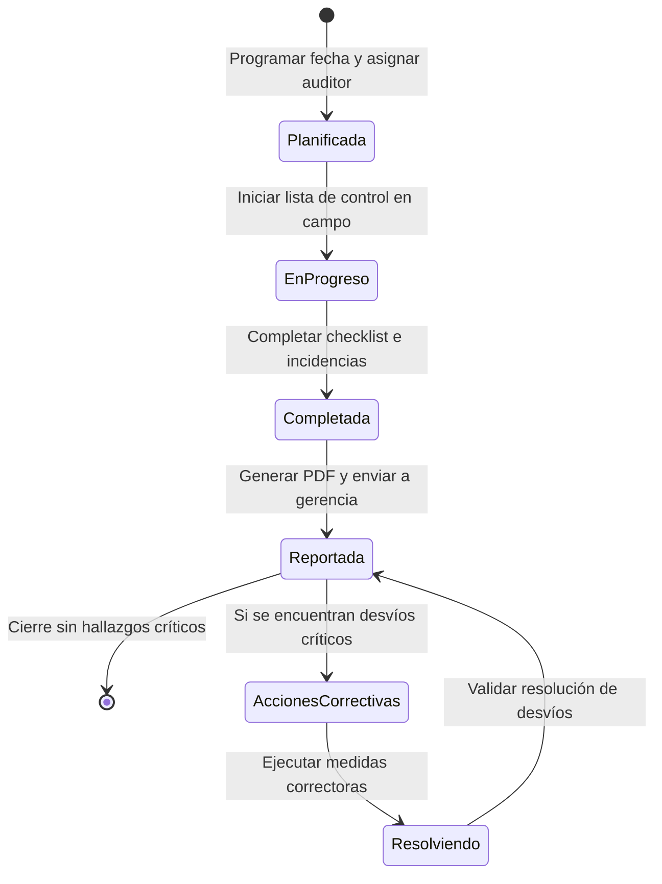

# Flujo de Auditorías e Inspecciones SySO

El módulo de auditorías permite a los inspectores planificar, realizar y cerrar inspecciones de seguridad en plantas o proyectos de obra, generando alertas y asignando planes de acción correctivos.

---

## Ciclo de Vida de una Auditoría

## Etapas Detalladas

### 1. Planificación
- Un coordinador de seguridad programa una inspección para una fecha específica, en una sucursal/obra concreta.
- Se selecciona el checklist a utilizar (ej: "Inspección de Equipos de Protección Individual (EPIs)").
- Se asigna a un Inspector (usuario del tenant).

### 2. Ejecución (En Progreso)
- El inspector abre la aplicación (diseño mobile-friendly para uso en campo).
- Responde cada punto del checklist: **Cumple**, **No Cumple**, o **No Aplica**.
- Para cada desvío ("No Cumple"), el inspector puede:
  - Tomar una foto (se sube a Supabase Storage).
  - Añadir una descripción detallada de la condición insegura.
  - Seleccionar el nivel de criticidad (Bajo, Medio, Alto).

### 3. Cierre y Plan de Acción
- Al finalizar, se calcula el porcentaje de cumplimiento.
- Si se detectan desvíos críticos, el sistema genera automáticamente un plan de acción, asignando plazos de resolución a los responsables de área en la planta.
- Se emite un reporte en PDF listo para descargar.
