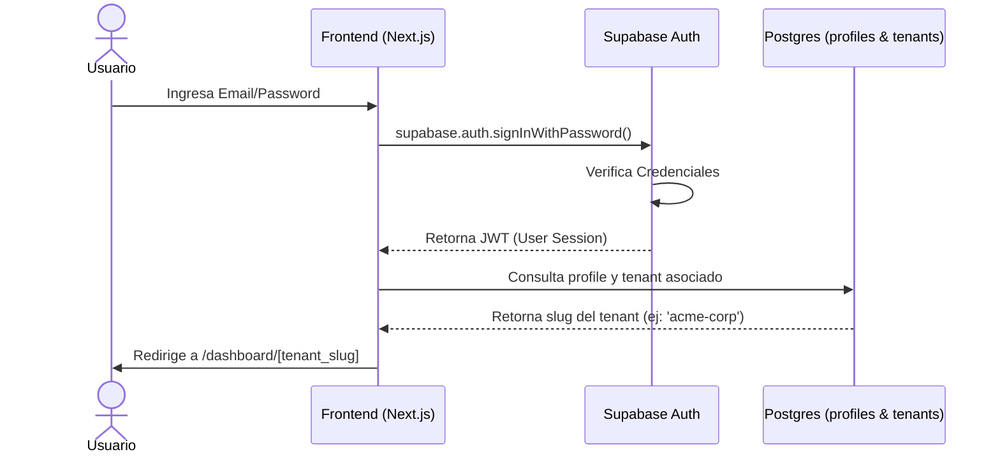

# Flujo de Autenticación y Enrutamiento Multi-tenant

Este flujo describe cómo un usuario inicia sesión en la plataforma y es redirigido a su espacio de trabajo correspondiente (workspace del Tenant).

---

## Proceso de Login y Redirección

El sistema utiliza **Supabase Auth** para gestionar las sesiones, JWTs y la seguridad.

## Detalles del Flujo de Enrutamiento

1. **Ingreso**: El usuario accede a `https://gestionsyso.com/login`.
2. **Autenticación**: Supabase autentica las credenciales y devuelve una cookie de sesión cifrada de forma segura (HttpOnly).
3. **Validación de Perfil**: El Middleware de Next.js intercepta la solicitud, lee la sesión del usuario y consulta la tabla `profiles` mediante Supabase para obtener el `tenant_id` y el `slug` asociado en la tabla `tenants`.
4. **Redirección**:
   - Si el usuario tiene un perfil válido y está asignado a un tenant activo, es redirigido automáticamente a `https://gestionsyso.com/[tenant-slug]/dashboard`.
   - Si no está asociado a ningún tenant, es redirigido a `https://gestionsyso.com/onboarding` para crear uno nuevo o solicitar acceso.
5. **Protección**: Las rutas dinámicas `/[tenant-slug]/*` están protegidas por el Middleware de Next.js, verificando que el usuario autenticado realmente pertenezca a ese `tenant-slug`.
