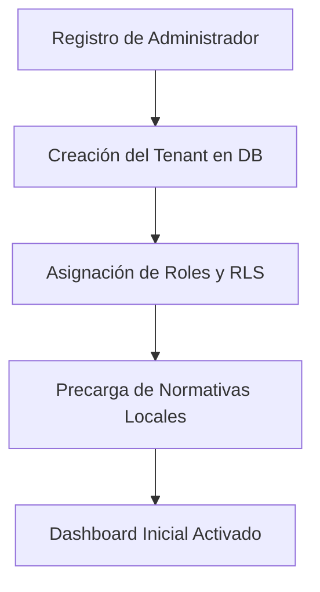

# Flujo de Registro de Nuevo Tenant (Onboarding)

Este documento detalla los pasos requeridos para registrar una nueva organización/empresa en el SaaS **Gestión SySO** y habilitar su subdominio o espacio de trabajo aislado.

---

## Fases del Onboarding

El registro de una nueva cuenta corporativa se realiza en 3 pasos clave:

### 1. Datos del Usuario Administrador
- El usuario proporciona su nombre, email, contraseña y cargo en la empresa.
- Se registra la cuenta de usuario en Supabase Auth.
- Se envía un correo electrónico de verificación de cuenta.

### 2. Creación del Workspace del Tenant
- Se solicita el nombre de la empresa, tamaño de la empresa, y país de operación.
- El sistema autogenera un `slug` único de URL a partir del nombre de la empresa (ej: "Constructora Delta" -> `constructora-delta`).
- Se inserta un nuevo registro en la tabla `tenants`.
- Se asocia el ID del usuario creador como `owner_id` en el tenant, y se le asigna el rol de `admin` en la tabla `profiles` correspondiente.

### 3. Configuración Inicial de Seguridad e Higiene
- Configuración de las sucursales u obras activas.
- Selección del catálogo de normativas locales aplicables (ej: Ley N° 19.587 en Argentina, NOM-035 en México, etc.).
- A partir de esta selección, el sistema precarga los checklists de inspección estándar en la base de datos correspondientes al tenant.

## Estructura del Tenant en URL
Para mejorar el branding y aislamiento visual, el formato de ruta es:
`https://app.gestionsyso.com/[tenant_slug]` (ej: `https://app.gestionsyso.com/constructora-delta/dashboard`).
Esto se gestiona utilizando los Dynamic Route Segments de Next.js.
